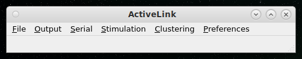

# ActiveLink
Open-sourced tool for quantified targeting of cells and online manipulation of neural activity

## Instructions for setting up ActiveLink
ActiveLink is written entirely in python. Its modular structure should make it easy for users to add in their own processing modules for their own use cases.
I recommend using some kind of virtual environment for installing ActiveLink (conda works great). Some of the libraries that are necessary for running the program include (this list will grow as more features are released):

1. PyQt5 (for the interface)
2. Numpy
3. Scipy

## User guide
As is, ActiveLink is only compatible with SpikeGadgets supplied software [Trodes](https://spikegadgets.com/trodes/).
From the commandline, run

    $ python -O ActiveLink.py

This should open the main window.

