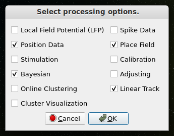
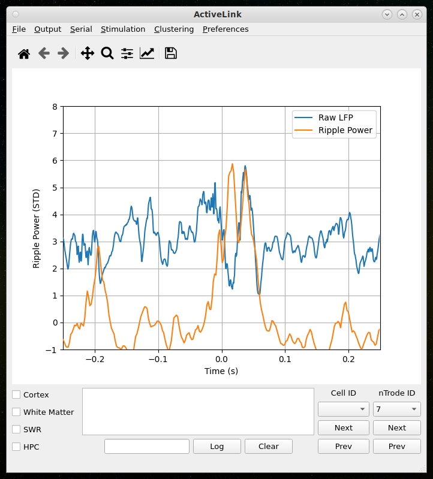
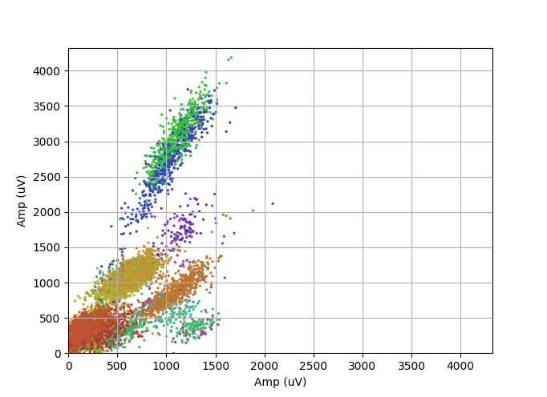
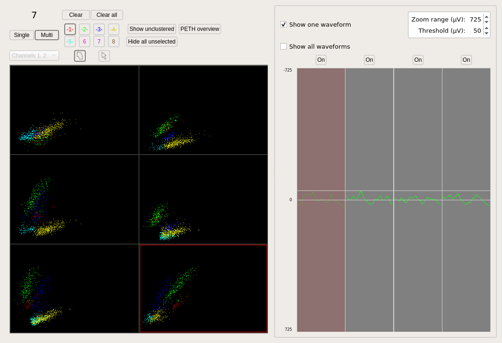
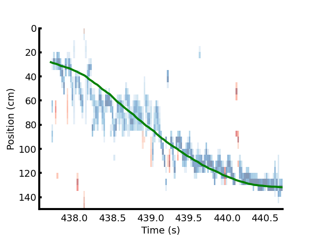

# ActiveLink
This project is an attempt to provide a single interface for real-time analysis and closed-loop feedback for neural activity.
Much of the work in this project is devoted to aid Hippocampal cell targeting and analysis of pyramidal cell activity in the Hippocampus, known to encode place (See [this](https://www.nobelprize.org/prizes/medicine/2014/okeefe/lecture/) for the nobel lecture by John O'Keefe on spatial cells in the Hippocampal formation).
The end goal is to be able to stream and process Local Field Potential (LFP), single unit activity, as well as animal behavior for low-latency closed-loop experiments.

## Instructions for setting up ActiveLink
ActiveLink is written entirely in python. Its modular structure should make it easy for users to add in their own processing modules for their own use cases.
I recommend using some kind of virtual environment for installing ActiveLink (conda works great). Some external python libraries are necessary for running the program (this list will grow as more features are released):

1. PyQt5 (for the interface)
2. Numpy
3. Scipy
4. OpenCV

## User guide
As is, ActiveLink is only compatible with SpikeGadgets supplied software [Trodes](https://spikegadgets.com/trodes/).
From the commandline, run

    $ python -O ActiveLink.py

This should open the main window.
The "-O" option runs the program in the most efficient mode. Running it without that results in extensive logging which while useful for debugging, slows down the program considerably.

Select "File > Connect" to launch a connection to [Trodes](https://spikegadgets.com/trodes/), the recording software provided by SpikeGadgets.

Each processing stream launches a python [process](https://docs.python.org/3/library/multiprocessing.html#multiprocessing.Process) which performs relevant computations while passing aggregated results to the graphics pipeline periodically.

# Real-time signal processing
One of the most striking phenomenon observed in neural signals are oscillations.
Within the hippocampus, during ambulatory behavior, theta is most common.

# Logging Infrastructure
With modern electrophyisiology we are able to record hundreds of cells simultaneously from virtually any brain region.
Conventional techniques for localization and targeting of cells in brain areas often rely of manual interpretation of the neural signals.
With increasing recording sites, it is becoming increasingly difficult to manually track and assess the signal at individual recording sites.
This is especially true with Hippocampal research, where the curvature of principle cell layer in CA1 makes independently adjustable tetrode bundles the best choice for obtaining high cell yield.
I have built some logging infrastructure to aid cell targetting, guided mainly by Sharp-Wave Ripples.

Without connecting the program to an underlying data-acquisition system, it can be used for logging and tracking electrode movements.

# Online detection and disruption of Sharp-Wave Ripples

## Upcoming Features
I am currently developing and testing more features for closed-loop experiments.
Two of the main features under active development are
1. Online clustering
2. Real-time Bayesian inference

# Online clustering of single-unit activity
***Coming Soon***
Below some experimental results from online-clustering over the first 3 minutes of a recording session - here, peak amplitude on two of the four channels of a tetrode bundle are plotted for all the action potential received from Trodes.
The cluster identities are color coded.

# Real-time Bayesian inference of spatial position from place-cell activity
Trodes allows the user to define cluster boundaries.
An illustration of hand-clustered data is shown below.

The cell identities for each cell are then communicated from Trodes to ActiveLink.
Below are the results of Bayesian inference on an animal's mental position (physical position tracked by a camera shown in green) is shown.
The blue map shows the posterior probability of the animal's position obtained using the neural data and a uniform prior.

